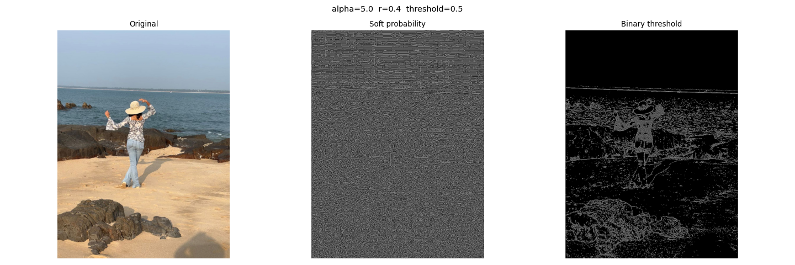

# Vision: Biologically Motivated Discrete Edge Representation

A PyTorch implementation of a biologically motivated, training-free visual 
preprocessing pipeline inspired by the early visual pathway i.e
retinal ganglion cells and V1 simple cells. The pipeline maps raw images to 
a 27x compressed discrete edge representation while preserving perceptually 
relevant structure.

The core finding: with just 9 discrete edge symbols, images can be 
reconstructed such that subjects remain easily recognisable by a human 
observer, suggesting the representation preserves the perceptually 
discriminative structure of the original image.

## Pipeline
```
Raw image → Luminance weighting → Sobel edge gradients → 
Sigmoid edge probability estimation → Binarisation → 
9-template discrete edge map
```

Each 3×3 patch is assigned one of 9 discrete edge types:
diagonal (↘ ↙), horizontal (top, middle, bottom), 
vertical (left, centre, right), or no edge.
This produces a representation 27x smaller than the original.

## Motivation

Current vision models learn edge and orientation structure from scratch 
via gradient descent, requiring large amounts of training data to rediscover 
what neuroscience already tells us the brain does, edge labelling. This pipeline hardcodes that knowledge explicitly, 
leaving the downstream model free to learn higher-level structure.

## Folder Structure
- `assets/` — demo images
- `src/data.py` — Core `Preprocessor` class: luminance, Sobel gradients, 
   edge probability, binarisation, template matching
- `frontends/frontend_1.py` — Visualise edge probabilities and angles 
   on an input image using HSV colour encoding
- `frontends/frontend_2.py` — Visualise discrete edge map reconstruction 
   alongside original image
- `experiments/experiment_1.py` — Early pipeline exploration on CIFAR-10
- `experiments/experiment_2.py` — Grid search over sigmoid and threshold 
   parameters, evaluated by perceptual reconstruction quality
- `datasets/` — Sample images for testing
- `checkpoints/` — Saved model checkpoints (future use)

## Installation

1. Clone the repo:
```bash
git clone https://github.com/anaaya2302/Vision.git
cd Vision
```

2. Create and activate a virtual environment (miniconda recommended for 
   CUDA compatibility):
```bash
conda create -n vision python=3.10
conda activate vision
```

3. Install dependencies:
```bash
pip install -r requirements.txt
```

## Usage

Visualise edge detection on an image:
```bash
python frontends/frontend_1.py path/to/image.jpg
```

Visualise discrete edge map reconstruction:
```bash
python frontends/frontend_2.py path/to/image.jpg
```

Run parameter grid search:
```bash
python experiments/experiment_2.py path/to/image.jpg
```
Results saved to `grid_search/` with filenames encoding parameter values.

## Results

With parameters `r=0.4, threshold=0.5`, the discrete edge map preserves 
sufficient structure for human recognition from reconstruction alone.



## Future Work

- Gestalt-motivated edge continuity detection via vectorised compatibility 
  matching
- Use discrete edge tokens as input to a Vision Transformer for 
  classification
- Evaluate sample efficiency vs raw pixel baseline on ImageNet